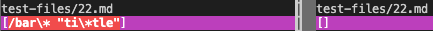
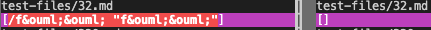

# Week 10 Lab Report

For this lab, I chose 2 tests from `test-files` where my implementation of MarkdownParse produced an output that differed from the other. These tests corresponded to different bugs on my side that could not be fixed with one code change.

---

I found the tests with different results through using the `vimdiff` command. To do this, I first directed the output of running course MarkdownParse on the 652 tests into a file named "results.txt" Then I directed the output of running my own MarkdownParse on the 652 tests into a file named "myresults.txt" then used the vimdiff command to compare the two files.

These are the pictures I have documenting my process:

These are the links to the two files with different results:

[test-file-22](https://github.com/MichaelYe48/cse15l-lab-reports/blob/main/test-files/22.md)

[test-file-32](https://github.com/MichaelYe48/cse15l-lab-reports/blob/main/test-files/32.md)

## Test 1

Neither implementation is correct, since the course implementation returns no links while my implementation returns the scrambled characters. The expected output should be: `[foo]`.

In this case, I will be examining the problem in my implementation. The bug occurs when determining the result that is to be printed from the argument the method has converted into a string. Rather than adding to the output the markdown version of the string inside the open and closed parantheses, the method should be adding the string inside the open and closed brackets to the output instead. Here is a picture of the section of the method that needs to be changed:

## Test 2

Neither implementation is correct, since the course implementation returns no links while my implementation returns the scrambled characters. The expected output should be: `[foo]` again.

In this case, I will be examining the problem in the course implementation. The bug occurs when in line 74, where the condition determining whether or not the provided string is a valid link fails to account for cases where the input could be something other than just an empty space or a new line

