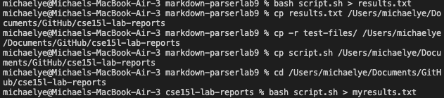
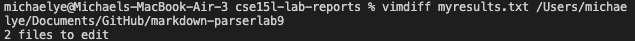
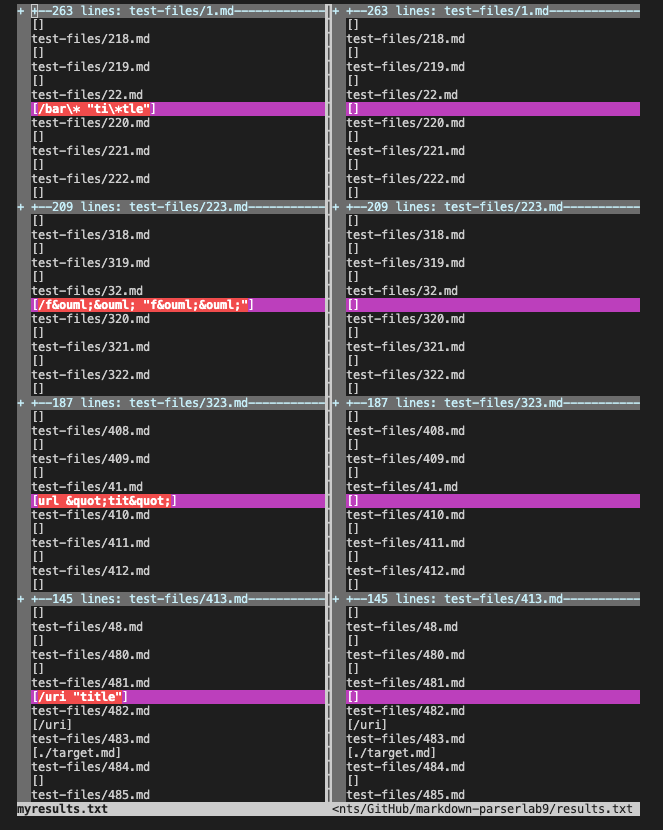
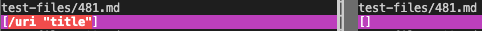
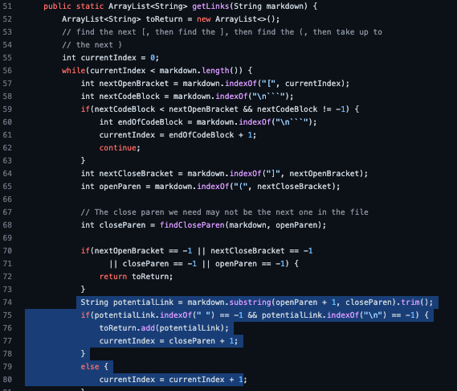
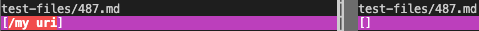
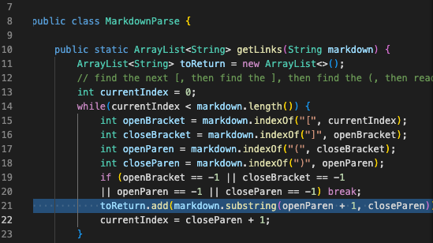

# Week 10 Lab Report

For this lab, I chose 2 tests from `test-files` where my implementation of MarkdownParse produced an output that differed from the course implementation. These tests corresponded to different bugs on both sides that could not be fixed with one code change.

---

I found the tests with different results through using the `vimdiff` command. To do this, I first directed the output of running the course implementation of MarkdownParse on the 652 tests into a file named `results.txt` Then I directed the output of running my own MarkdownParse on the 652 tests into a file named `myresults.txt` then used the vimdiff command to compare the two files.

These are the pictures I have documenting my process:

These are the links to the two files with different results:

[test-file-481](https://github.com/nidhidhamnani/markdown-parser/blob/main/test-files/481.md)

[test-file-487](https://github.com/nidhidhamnani/markdown-parser/blob/main/test-files/487.md)

## Test 1

Since the CommonMark demo site indicated that the 481st test file should produce a link, the course implementation returns the wrong output while mine returned correctly. The expected output should be `[/uri "title"]`, which is the same as my output but differs from the course output of `[]`. My actual output should be on the left below, the course output should be on the right.

In this case, I will be examining the problem in the course implementation. The bug occurs when in line 75, where the if-statement determining whether or not the provided string is a valid link fails to account for cases where a valid link is produced despite having a space in the url portion of the markdown code. To fix this issue, the if-statement needs more specific conditions, like checking for additional symbols to accurately determine valid urls.

## Test 2

Since the CommonMark demo site indicated that the 487th test file should not produce a link, the course implementation returns the right output while mine did not. The expected output should be `[]`, which is what the course output also had, but mine was `[/my uri]`. My actual output should be on the left below, the course output should be on the right.

In this case, I will be examining the problem in my implementation. I simply did not account for cases with an invalid url. My code only checks for the brackets and parantheses and merely returns the string value inside the parantheses. To fix this problem, I would have to implement additional if-statements to check if the string inside the parantheses is an actual url or not.

