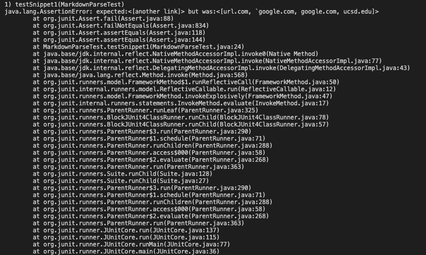

# Week 10 Lab Report

Here is the first test with different answers:

Here is the second test with different answers:

---
how i found the tests

## Test 1

Which implement is correct

indicate both outputs and also what the expected output is (list the links that are expected in the output)

describe the bug in about 2-3 sentences

## Test 2

Which implement is correct

indicate both outputs also what the expected output is (list the links that are expected in the output)
`[a.com, a.com(()), example.com]`

describe the bug in about 2-3 sentences

