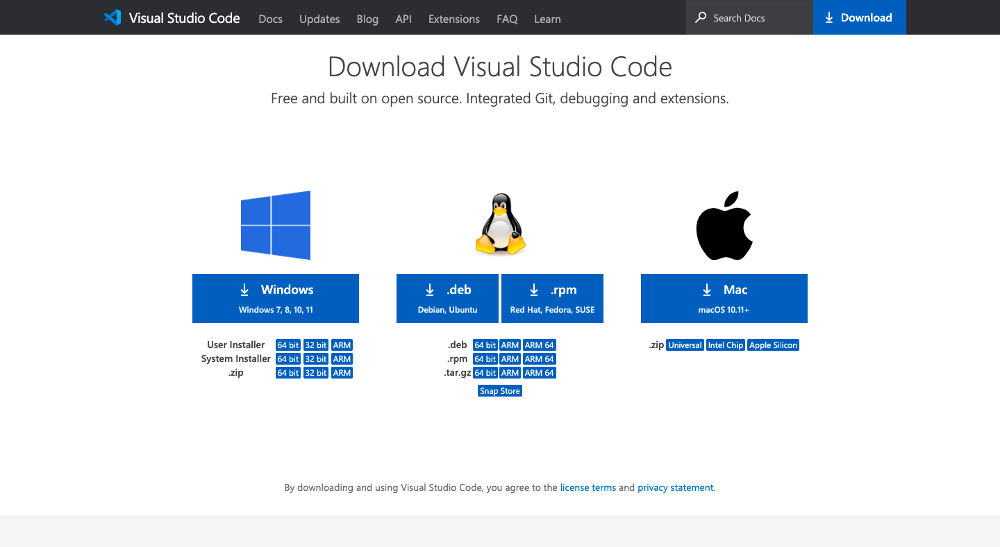
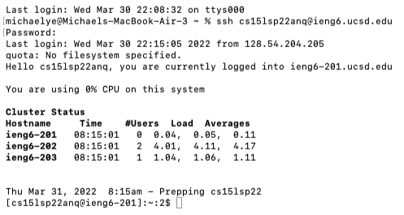
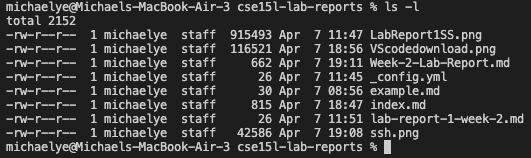
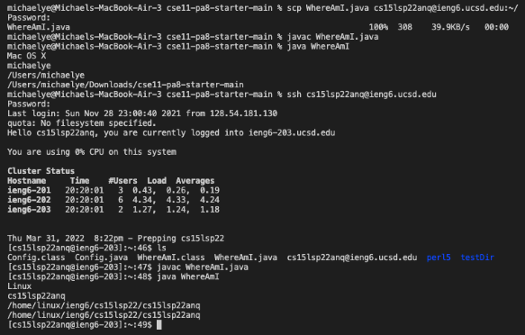
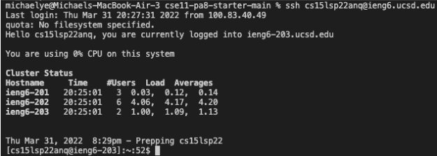
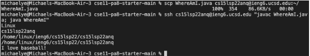

# Week 2 Lab Report

## Installing VScode

* click the appropriate download link for your computer
* follow the downloading steps given by your computer
* go into your downloads and open the file

## Remotely Connecting

* open terminal (preferably in VScode)
* use the ssh command along with your username and server name to connect to the server remotely 
`ssh <username>@<servername>`
* type in the password you set for the username and press enter

## Trying Some Commands

* in the terminal command line, type and enter commands such as `ls -l` and `pwd`
* `ls -l` lists the files contained in the directory as well as the accompanying information regarding the file
* `pwd` stands for print working directory and displays the current directory you are in

## Moving Files with scp

* to move a file from your local computer to the server, use the following command: 
`scp <filename> <username>@<servername>:<locationinserver>`
* for example: `scp WhereAmI.java cs15lsp22zz@ieng6.ucsd.edu:~/`
* enter the password to the server if prompted

## Setting an SSH Key

* to make server connection more convenient, we will be creating a pair of files using keygen so that the ssh command would substitute your password with the pair of files, allowing you to log on to the server without typing your password
* enter the command `ssh-keygen` and follow the command-line prompts
* save the key in /Users/*user-name*/.ssh/id_rsa and make sure you **do not** enter a passphrase

## Optimizing Remote Running

* we can optimize the time typing and running code by using the up arrow on the keyboard to access previous commands inputted
* this allows it so that we do not need to type out the entire command again, which can drastically reduce the number of keystrokes required to make something run
