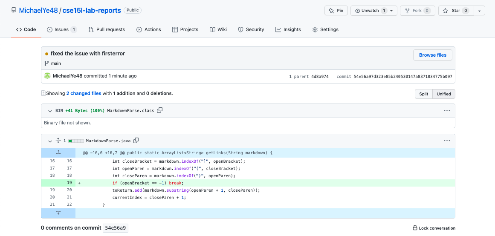

# Week 4 Lab Report

## Code Change 1

[Failure-inducing input file](https://github.com/MichaelYe48/markdown-parser/blob/main/test-file2.md)

The bug in my code was the failure to address possible failure inducing inputs, such as a file with an extra line at the end. This failure inducing input changes one of my variables in the while loop to -1. My while loop cannot terminate when the variables inside are negative, which causes my program to have an infinite loop and cause the "OutOfMemoryError" runtime exception.

## Code Change 2

[Failure-inducing input file](https://github.com/MichaelYe48/cse15l-lab-reports/blob/main/example3.md)

The bug in my code was the lack of checks to determine the end of a link without the end parantheses. The failure inducing input is a markdown file that has the opening parantheses but not the closing parantheses around the link. Since my code is still looking for the closing parantheses, it will include everything in the middle as part of the link before the next closing parantheses it finds. 

## Code Change 3

[Lab 2 work](lab-report-1-week-2.md)

sentence here