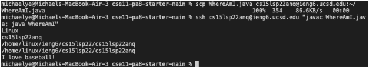

# Week 4 Lab Report

## Code Change 1

[Failure-inducing input file](https://github.com/MichaelYe48/markdown-parser/blob/main/test-file2.md)

sentence here

## Code Change 2

[Lab 2 work](lab-report-1-week-2.md)

sentence here

## Code Change 3

[Lab 2 work](lab-report-1-week-2.md)

sentence here