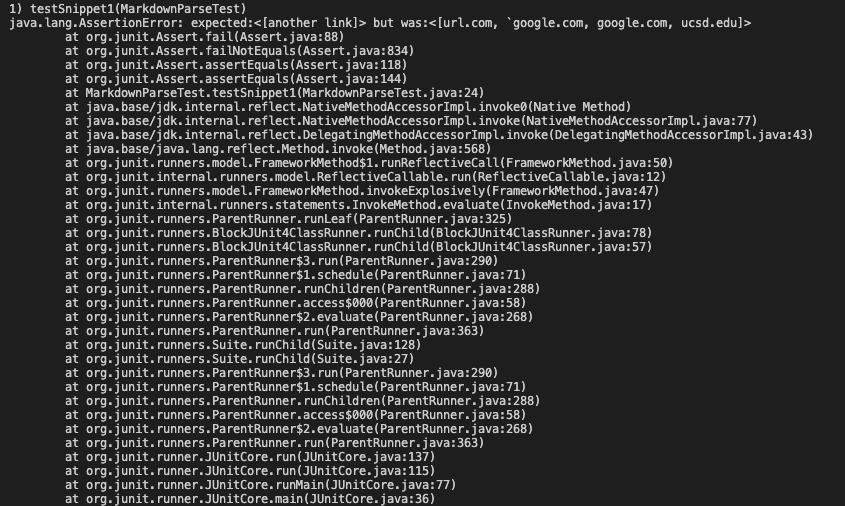
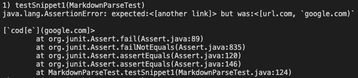
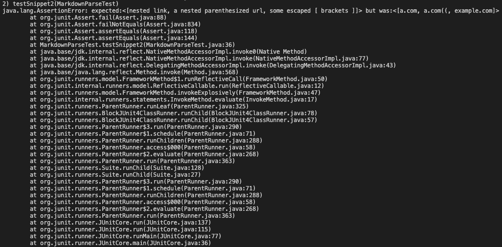
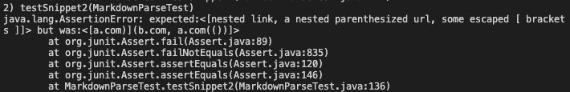
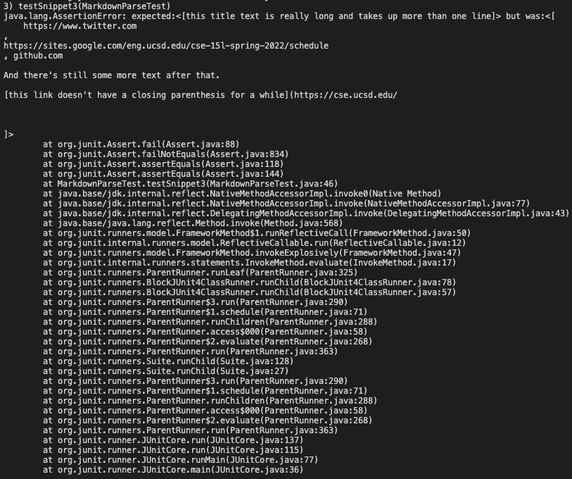
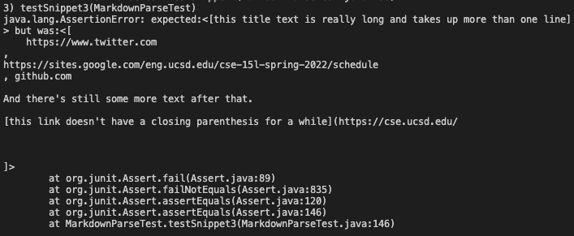

# Week 8 Lab Report

Here is the link to my markdown repository:
[markdown repo](https://github.com/MichaelYe48/markdown-parser)

Here is the link to the reviewed repository:
[markdown repo](https://github.com/thanhnhanlam/markdown-parser.git)

## Snippet 1

This is the expected output I have:

``[`google.com, google.com, ucsd.edu]``

Here is how I turned the expected output into a test in MarkdownParseTest.java:

This is the corresponding output for my implementation:

This is the corresponding output for the implementation I reviewed:

## Snippet 2

This is the expected output I have:

`[a.com, a.com(()), example.com]`

Here is how I turned the expected output into a test in MarkdownParseTest.java:

This is the corresponding output for my implementation:

This is the corresponding output for the implementation I reviewed:

## Snippet 3

This is the expected output I have:

`[https://www.twitter.com, https://sites.google.com/eng.ucsd.edu/cse-15l-spring-2022/schedule, https://cse.ucsd.edu/]`

Here is how I turned the expected output into a test in MarkdownParseTest.java:

This is the corresponding output for my implementation:

This is the corresponding output for the implementation I reviewed:

## Question 1

Yes, I think there is a small code change that allows my MarkdownParse work for snippet 1. This code change will be adding a conditional statement that checks for inline code with backticks after the first sqaure bracket, therefore checking if the characters inside of the brackets belong to a string or not. If the characters inside contains the backtick, then the while loop will break after updating the `currentIndex` variable.

## Question 2

No, I do not think there is a small codechange that will make my MarkdownParse work for snippet 2. Checking for nested parentheses involves implementing a stack data type that checks for completed bracket or parantheses pairs. This process will need to add elements into a list and remove the items after a match and then check if the list is empty at the end all while keeping account of the indices, which will take more than 10 lines to implement.

## Question 3

Yes, I think there is a small code change that will make my MarkdownParse work for snippet 3. This code change involves adding a conditional statement checking for newlines in between brackets or parantheses using /n. If there is a new line, then the while loop will break after updating the `currentIndex` variable.
