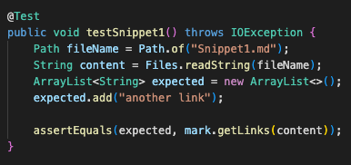
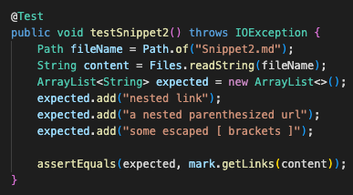
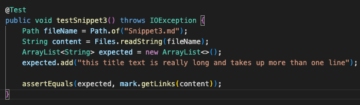

# Week 8 Lab Report

Here is the link to my markdown repository:
[markdown repo](https://github.com/MichaelYe48/markdown-parser)

Here is the link to the reviewed repository:
[markdown repo](https://github.com/thanhnhanlam/markdown-parser.git)

## Snippet 1

This is the expected output I have:

`[another link]`

Here is how I turned the expected output into a test in MarkdownParseTest.java:

This is the corresponding output for my implementation:

This is the corresponding output for the implementation I reviewed:

## Snippet 2

This is the expected output I have:

`[nested link, a nested parenthesized url, some escaped [ brackets ]]`

Here is how I turned the expected output into a test in MarkdownParseTest.java:

This is the corresponding output for my implementation:

This is the corresponding output for the implementation I reviewed:

## Snippet 3

This is the expected output I have:

`[this title text is really long and takes up more than one line]`

Here is how I turned the expected output into a test in MarkdownParseTest.java:

This is the corresponding output for my implementation:

This is the corresponding output for the implementation I reviewed:

## Question 1

## Question 2

## Question 3

