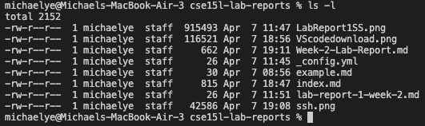

# Week 8 Lab Report

Here is the link to my markdown repository:

Here is the link to the reviewed repository:

## Snippet 1

This is the expected output I have:

Here is how I turned the expected output into a test in MarkdownParseTest.java:

This is the corresponding output for my implementation:

This is the corresponding output for the implementation I reviewed:

## Snippet 2

This is the expected output I have:

Here is how I turned the expected output into a test in MarkdownParseTest.java:

This is the corresponding output for my implementation:

This is the corresponding output for the implementation I reviewed:

## Snippet 3

This is the expected output I have:

Here is how I turned the expected output into a test in MarkdownParseTest.java:

This is the corresponding output for my implementation:

This is the corresponding output for the implementation I reviewed:

## Question 1

## Question 2

## Question 3

