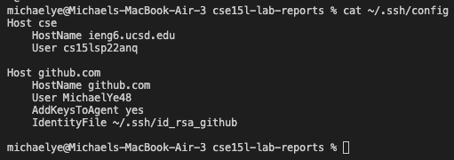
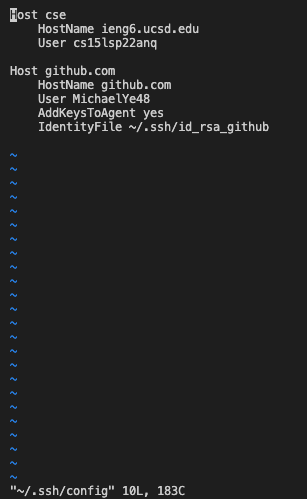
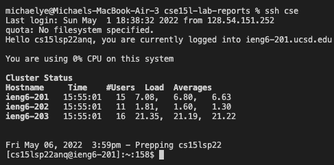
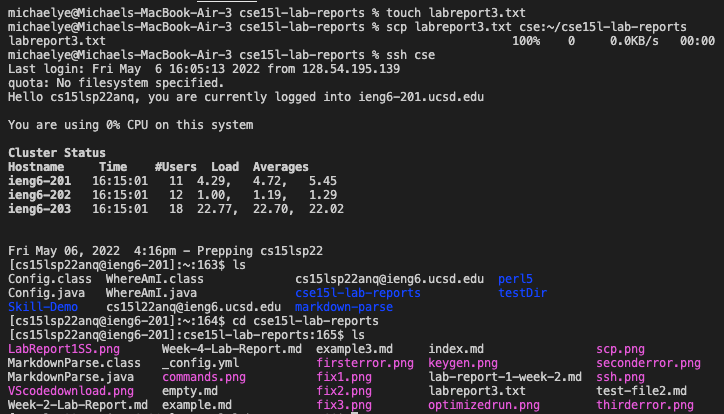
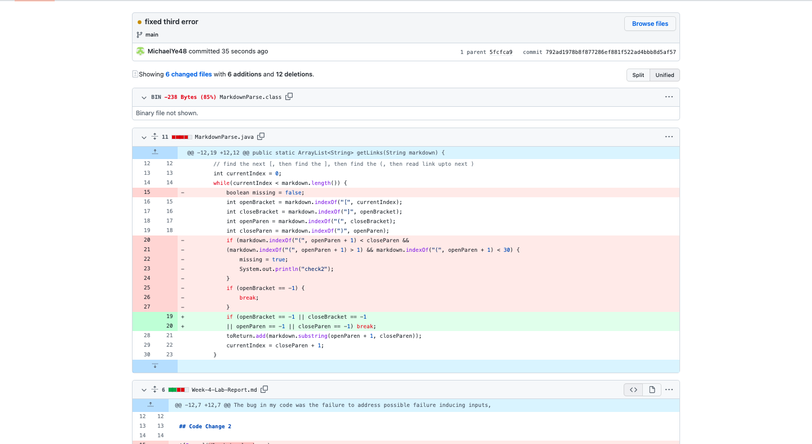
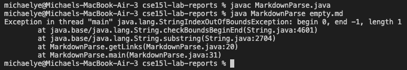

# Week 6 Lab Report

## Streamlining ssh Configuration



```
michaelye@Michaels-MacBook-Air-3 cse15l-lab-reports % echo this is how I edited the ssh config file
this is how I edited the ssh config file
michaelye@Michaels-MacBook-Air-3 cse15l-lab-reports % vi ~/.ssh/config
```



To edit my config file, I used vim and pasted the following code in:

```Host cse
    HostName ieng6.ucsd.edu
    User cs15lsp22zzz (use your username)
```

---

This is the command `ssh cse`



I typed `ssh cse` with `cse` replacing the old `cs15lsp22anq@ieng6.ucsd.edu`.

---

This is the command `scp labreport3.txt cse:~/cse15l-lab-reports`


I used the scp command to move a new file I created into the cse15l-lab-reports directory of the ieng6 server.

## Setup Github Access from ieng6


sentence here

---


sentence

---


sentence

---

[Failure-inducing input file](https://github.com/MichaelYe48/cse15l-lab-reports/blob/main/empty.md)

sentence

## Copy whole directories with `scp -r`



sentence

---



sentence

---


sentence


