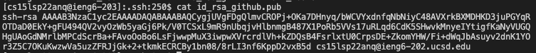
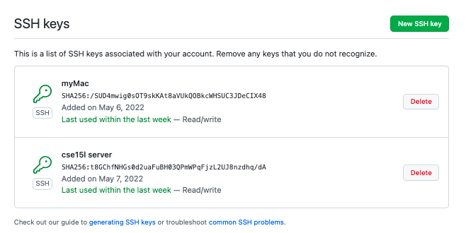
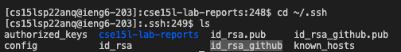

# Week 6 Lab Report

## Streamlining ssh Configuration


```
michaelye@Michaels-MacBook-Air-3 cse15l-lab-reports % echo this is how I edited the ssh config file
this is how I edited the ssh config file
michaelye@Michaels-MacBook-Air-3 cse15l-lab-reports % vi ~/.ssh/config
```


To edit my config file, I used vim and pasted the following code in:

```Host cse
    HostName ieng6.ucsd.edu
    User cs15lsp22zzz (use your username)
```

---

This is the command `ssh cse`


I typed `ssh cse` with `cse` replacing the old `cs15lsp22anq@ieng6.ucsd.edu`.

---

This is the command `scp labreport3.txt cse:~/cse15l-lab-reports`


I used the scp command to move a new file I created into the cse15l-lab-reports directory of the ieng6 server.

## Setup Github Access from ieng6





After making the public key on my local computer, I copied the contents in the public key file and pasted it into a new ssh key in github.

---



After using the `ssh-keygen` command during which I made a id_rsa_github file, I got the private key file in my .ssh directory.

---


I ran into problems trying to push the commits I made as I was still prompted to type in my username and password even after setting up the tokens. To fix this problem I looked at Stack Overflow and found this command that fixed the problem.
`git remote set-url origin git@github.com:<Username>/<Project>.git`

---

[Commit Link](https://github.com/MichaelYe48/cse15l-lab-reports/commit/7280ab954f597d70c3150ce6c147930ecd8c2ffe)

This link points to my commit history for this lab report since I git pushed my changes I made to this file through my local computer terminal. Very meta. I attached another image of me doing it again down below.


## Copy whole directories with `scp -r`


sentence

---


sentence

---


sentence


